# Shop App

## Description
**Shop App** is an e-commerce web application that enables users to browse products, add items to their shopping cart, and complete the checkout process. The application also features an admin panel where administrators can manage the product inventory by adding, updating, or deleting products. Additionally, it includes functionalities for user authentication, authorization, and role management to ensure secure access for different user types. All forms in the application are validated, and users receive email confirmations upon registration and password reset. The application is integrated with the Iyzico Payment Gateway test service for payment processing.

### Techonologies Used
- **Frontend**: Razor Views (CSHTML, CSS, C#), Bootstrap, DataTables, CKEditor
- **Backend**: ASP .NET Core MVC, Entity Framework Core, Identity Framework
- **Database**: MySQL
- **Third Party Integrations**: Iyzico Payment Gateway, Microsoft Email Service

## Features
- **Product Search & Categories**: Users can search for products according to their name and description. Also, products are categorized.
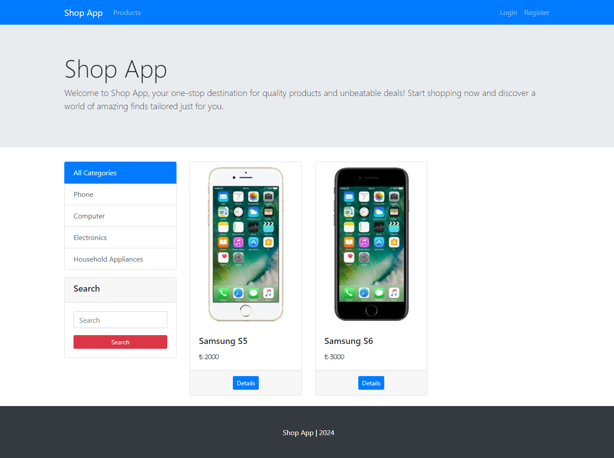
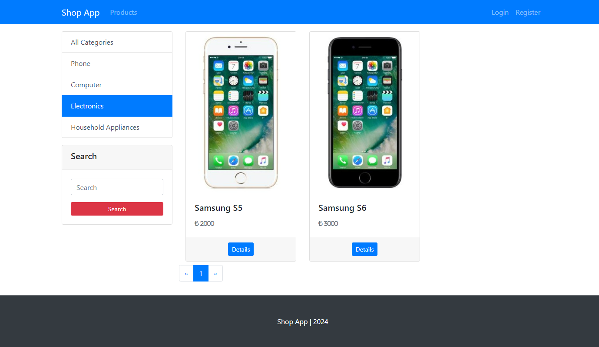
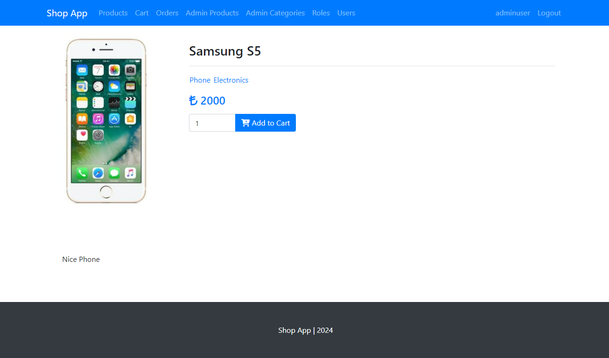

- **User Authentication & Authorization**: Users can register, login, and logout. Only authenticated users have a shopping cart and only authorized users can access admin panel.
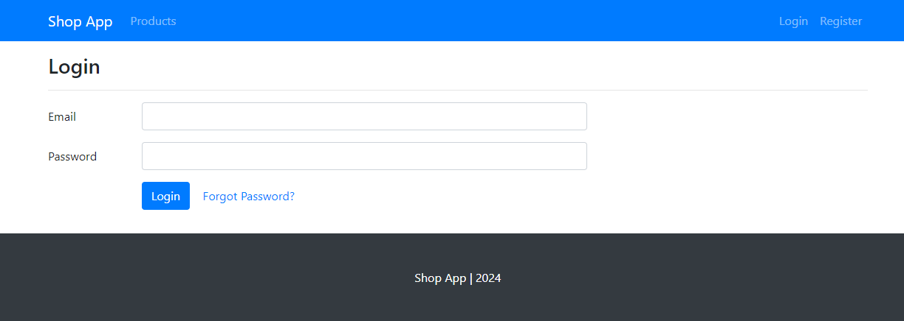
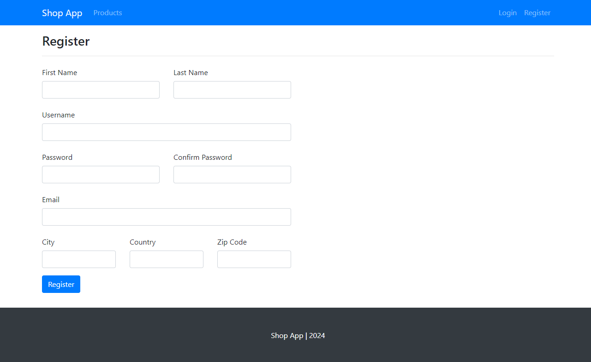
- **Shopping Cart**: Users can add products to cart and checkout.
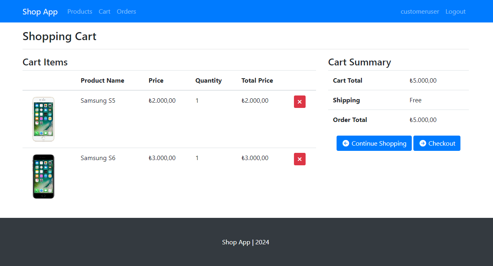
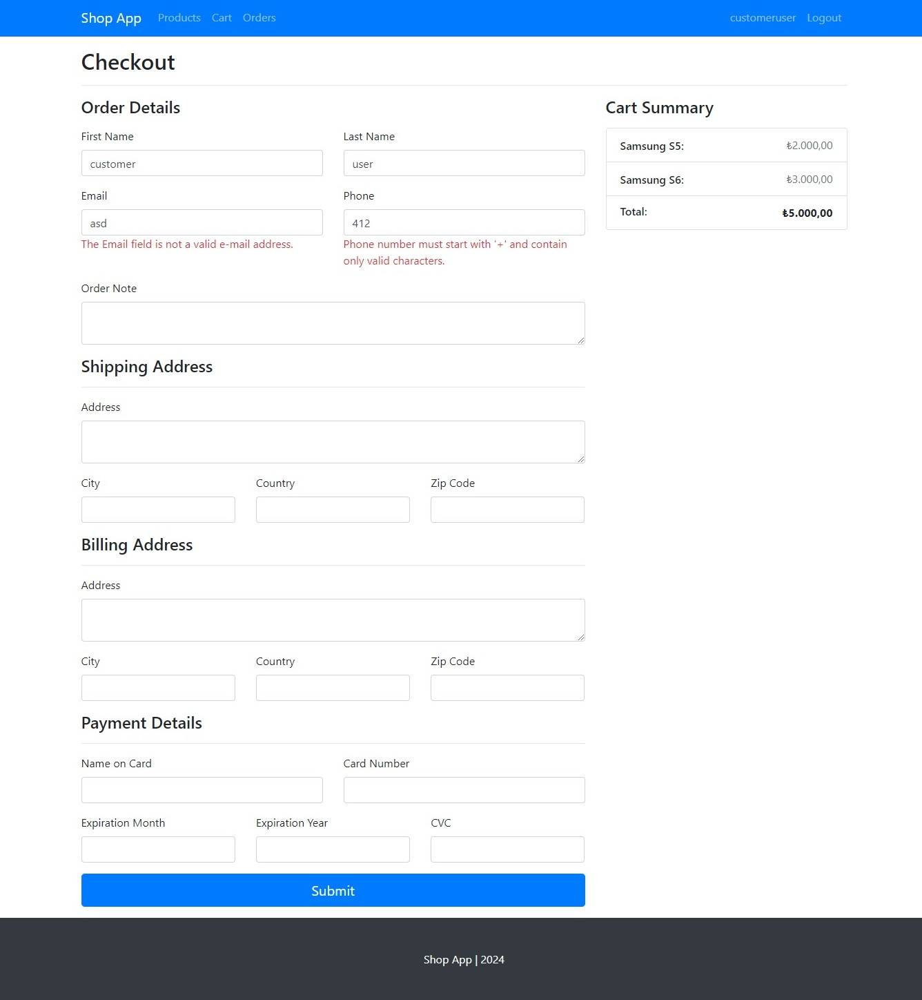
- **Order History**: Users can view their order history.
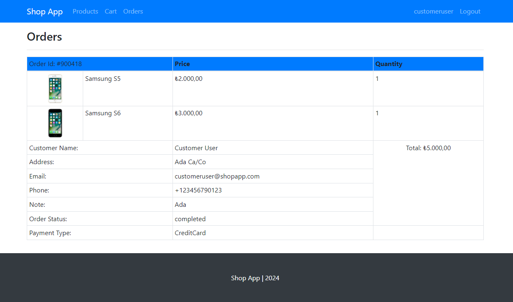
- **User Profile & Password Management**: Users can view and edit their profiles, including changing their passwords.
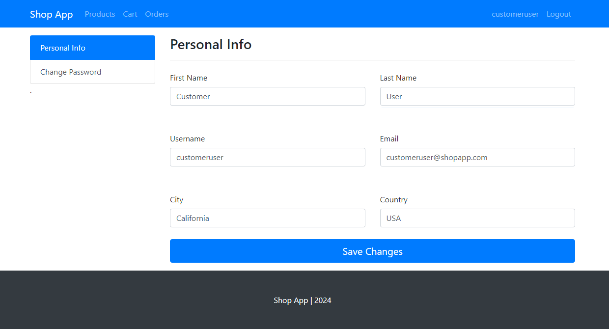
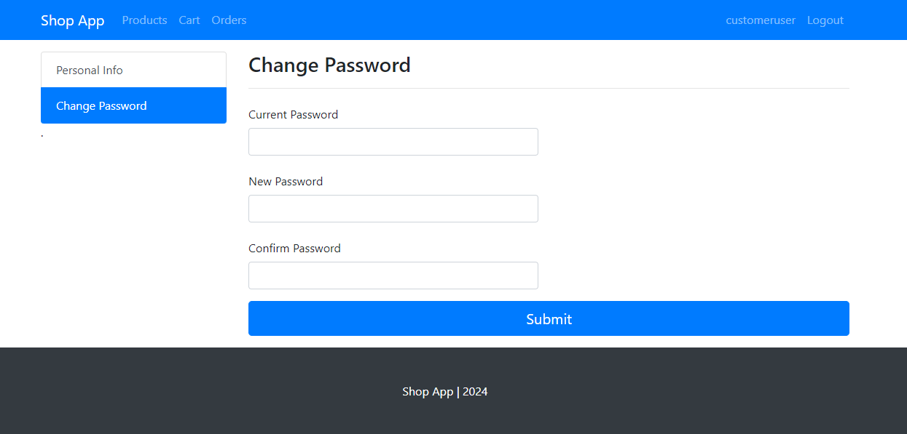
- **Admin Panel**: Admins can add, update, or delete products and categories, as well as manage user roles, edit user information, and delete users as needed. 
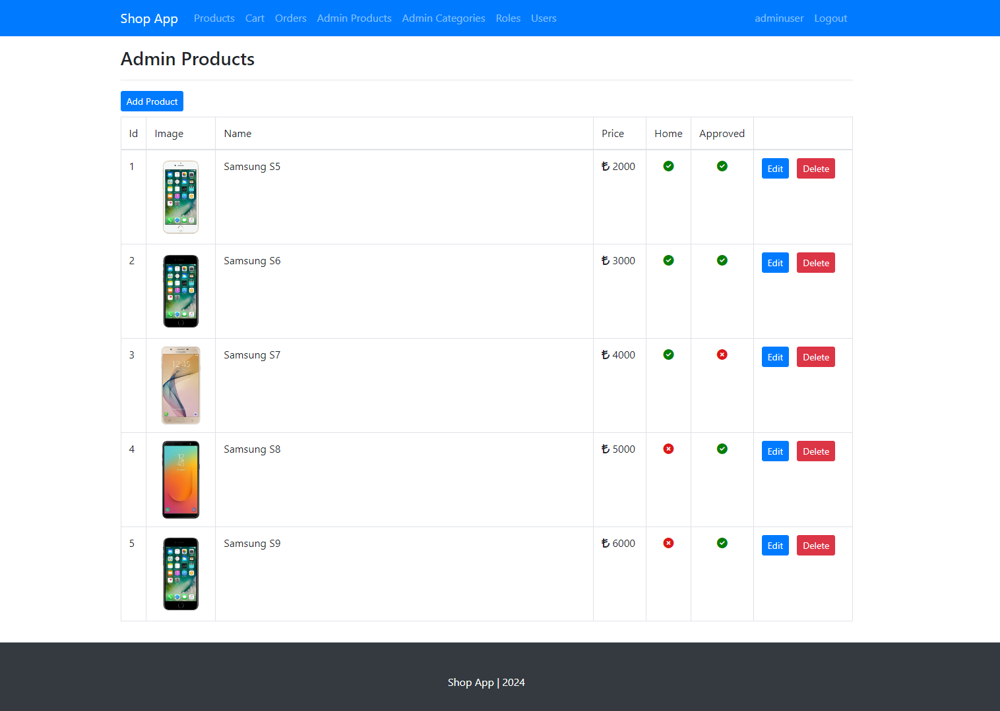
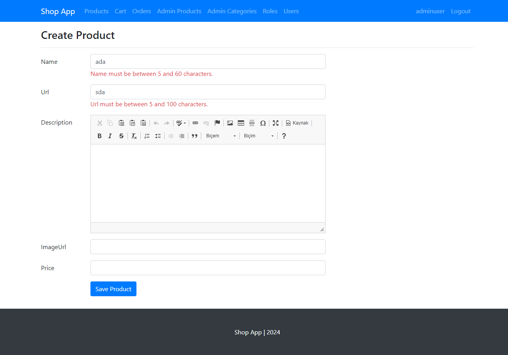
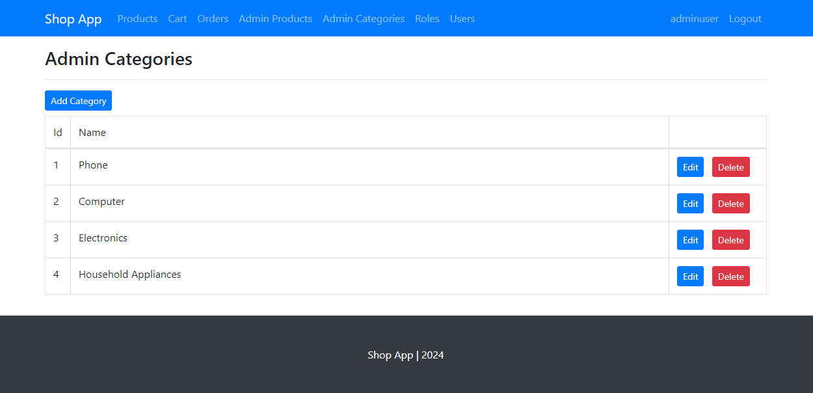
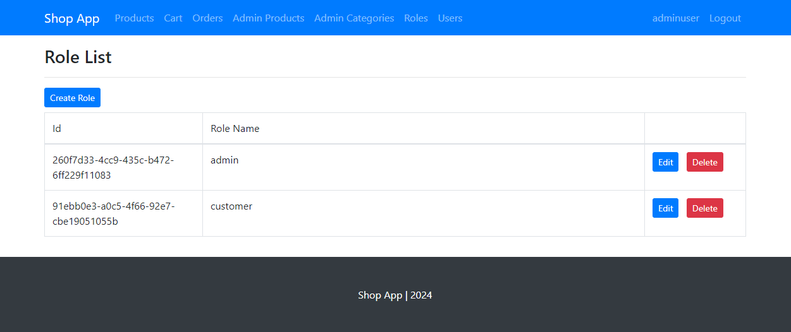
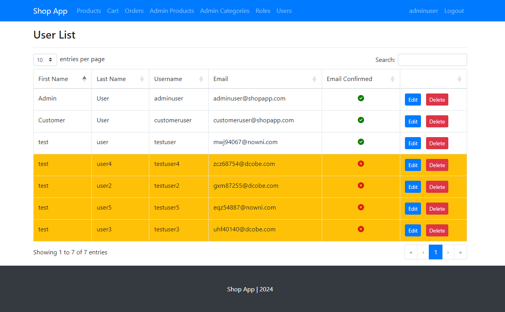
- **Email Confirmation**: Users have to confirm their email address. Automated email is sent to the user's email address upon registration and password reset.
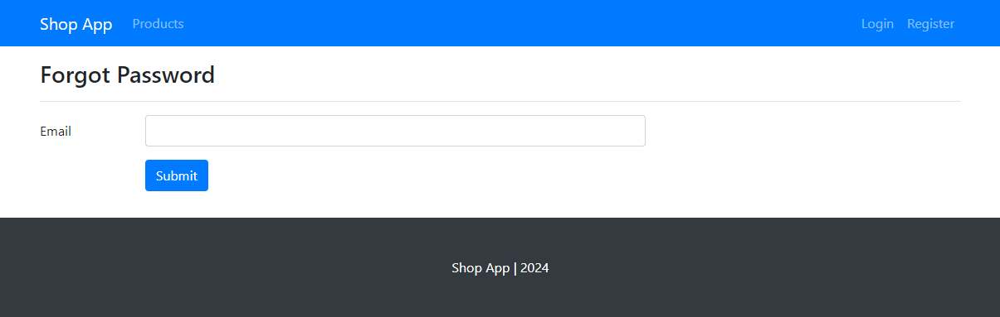
- **Payment Gateway**: Iyzico Payment Gateway test service is integrated.
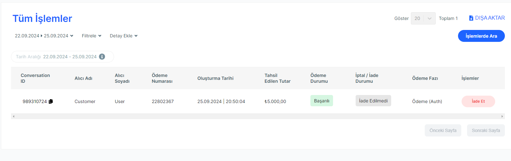

## Installation Steps

1. Clone the repository:
```bash
git clone https://github.com/Cydonia01/shop-app
```

2. Open the project in Visual Studio or Visual Studio Code and restore the dependencies.
```bash	
dotnet restore
```
3. Configure the `appsettings.json`:
    - Set your database connection string
    - Add API keys for the payment gateway
    - Configure the email service
<br>
4. Run database migrations:
```bash
dotnet ef database update
```
5. Run the project:
```bash
dotnet run
```

## Third-Party Integrations
- **Iyzico Payment Gateway**: Iyzico test service is integrated for payment processing. You need to create an account on the Iyzico website and get your API keys.
- **Email Service**: An email service is used for sending automated emails. You need to configure the email service in the `appsettings.json` file.